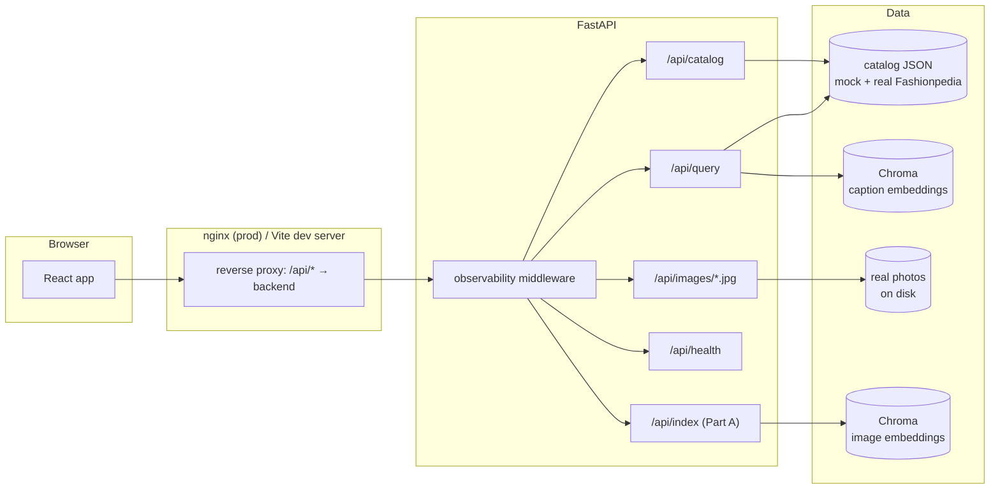
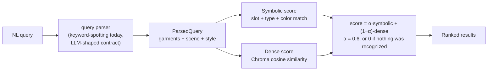

# Strand

[](https://github.com/sh4shv4t/strand/actions/workflows/ci.yml)


Compositional fashion image search — retrieval that binds garments, colors, scene, and style as separate fields instead of pooling everything into one embedding, so a query like "a red tie and a white shirt" doesn't also match a white tie and a red shirt.

Built for the Glance ML internship take-home assignment. See [`Working_notes.md`](./Working_notes.md) for the full engineering log: architecture options considered, dataset plan, empirical results, and open decisions.


## Overview

Vanilla CLIP/SigLIP embeddings encode a whole image as one dense vector, which is enough for coarse retrieval but fails on compositional queries — attributes get "bag of words"-ed together, so color-swapped images score similarly. Strand instead extracts a structured schema per image (garments bound to slots, plus scene and style) and scores queries against that schema with a weighted-hybrid retriever, falling back to dense similarity for phrasing the schema doesn't capture.

This repo currently ships a scaffold of that pipeline with mocked data: a hand-written catalog, a rule-based query parser standing in for an LLM parser, and a real implementation of the weighted-hybrid scoring, so the retrieval logic and API/UI contract are testable end-to-end ahead of real model and dataset integration.

## Architecture



Same-origin from the browser's point of view: nginx proxies `/api/*` server-side in production, so no CORS handling is needed on that path at all.

### Query pipeline



The query path only ever touches the lightweight parser and an approximate nearest-neighbor lookup, never a heavy model at request time, which is what makes the scalability argument in `Working_notes.md` §13 hold at any catalog size.

## Tech stack

- **Backend:** Python, FastAPI, Pydantic
- **Frontend:** React, TypeScript, Vite, Tailwind CSS

## Project structure

```
strand/
├── Working_notes.md      # architecture options, dataset plan, tradeoffs, open decisions
├── .github/workflows/ci.yml   # backend pytest + frontend build/lint on push/PR
├── docker-compose.yml     # backend + frontend, wired together
├── backend/
│   ├── Dockerfile
│   ├── .env.example       # env vars, documented; sane defaults without a .env at all
│   ├── scripts/
│   │   ├── pull_fashionpedia_sample.py   # regenerates real_catalog_sample.json + images
│   │   ├── eval_baselines.py             # dense-only vs. hybrid comparison
│   │   ├── eval_clip_baseline.py         # real vanilla-CLIP image baseline
│   │   ├── tag_real_catalog_scene_style.py   # zero-shot CLIP tagging, tried and not applied, see Working_notes.md §12.3
│   │   ├── build_image_vector_index.py   # Part A batch driver: real CLIP feature extraction + persistent storage
│   │   └── extract_attributes_with_vlm.py   # fills in color/scene/style via Gemini, needs GEMINI_API_KEY
│   ├── tests/                  # pytest suite, see Testing below
│   └── app/
│       ├── schema.py          # Pydantic models, incl. the shared ExtractedAttributes schema
│       ├── observability.py   # structured logging + OpenTelemetry (console exporter)
│       ├── data/               # mock decoy-pair records, a real Fashionpedia sample, real photos
│       ├── services/
│       │   ├── query_parsing.py       # entry point: real LLM parser, falls back to keywords
│       │   ├── query_parser.py        # keyword-spotting fallback parser
│       │   ├── llm_query_parser.py    # real Gemini query parser
│       │   ├── vlm_attribute_extractor.py  # real Gemini image attribute extractor
│       │   ├── gemini_client.py       # shared Gemini SDK wrapper
│       │   ├── catalog.py         # loads/caches the combined catalog
│       │   ├── vector_store.py    # dense similarity via a local Chroma collection
│       │   ├── retriever.py       # weighted-hybrid scoring (symbolic + dense)
│       │   ├── indexer.py         # Part A: real CLIP feature extraction, no API key needed
│       │   └── image_vector_store.py  # persistent Chroma collection for real image embeddings
│       └── routers/            # /api/query, /api/catalog, /api/index
└── frontend/
    └── src/
        ├── components/          # SearchBar, ExampleChips, ResultCard, Logo
        ├── lib/api.ts           # typed client for the query endpoint
        └── App.tsx
```

## Getting started

### Backend

```bash
cd backend
python -m venv .venv
.venv\Scripts\activate        # Windows
pip install -r requirements.txt
uvicorn app.main:app --reload --port 8000
```

### Frontend

```bash
cd frontend
npm install
npm run dev
```

The frontend dev server proxies `/api/*` to `http://localhost:8000`. Open the printed local URL (default `http://localhost:5173`).

### Docker

```bash
docker compose up --build
```

Serves the frontend at `http://localhost:5173` (nginx, proxying `/api/*` server-side to the backend container — no CORS involved) and the backend directly at `http://localhost:8000`. First boot downloads the ~80MB Chroma embedding model before the backend responds to anything; a named volume (`chroma-cache`) persists it so this only happens once. Copy `backend/.env.example` to `backend/.env` and uncomment the `env_file` line in `docker-compose.yml` to pass real env vars through.

## Testing

```bash
cd backend
pip install -r requirements-dev.txt
pytest -v
```

Tests run with `STRAND_DISABLE_EMBEDDINGS=1` (set in `tests/conftest.py`) so they exercise the deterministic word-overlap fallback instead of downloading the real embedding model — fast and network-independent. `tests/test_eval_accuracy.py` runs the 5 canonical eval queries from `Working_notes.md` end to end and checks retrieval accuracy, not just unit-level correctness. CI (`.github/workflows/ci.yml`) runs this suite plus a frontend build/lint on every push and PR.

## Baseline comparison

```bash
cd backend
python scripts/eval_baselines.py                      # dense-only vs. hybrid, no new deps
pip install -r scripts/requirements-eval.txt
python scripts/eval_clip_baseline.py                   # real vanilla-CLIP image baseline
```

Real numbers, not just theory: dense-only ties the hybrid on the 5 curated eval queries, but produces an *exact* score tie on the compositional decoy pair (it truly cannot tell "red tie, white shirt" from "white tie, red shirt" apart), while real vanilla CLIP on actual Fashionpedia photos scores worse than even that dense fallback (mean recall@5 0.256 vs. 0.564) on single-garment queries. See `Working_notes.md` §12 for the full breakdown and caveats.

## Part A: real feature extraction

```bash
cd backend
pip install -r scripts/requirements-eval.txt
python scripts/build_image_vector_index.py
```

Runs every real Fashionpedia photo on disk through a local CLIP model (`open_clip`, no API key) and persists a real embedding per image to an on-disk Chroma collection at `app/data/image_vector_index/` (gitignored, regenerable). This is genuine feature extraction from pixels, not from labels, closing the literal Part A requirement the mocked catalog alone doesn't. It doesn't touch color, scene, or style; that axis needs a real VLM call, see below.

## Real LLM and VLM integration (needs a Gemini API key)

```bash
cd backend
# GEMINI_API_KEY=... in backend/.env, see .env.example
python scripts/extract_attributes_with_vlm.py   # fills in color/scene/style on the real catalog
```

Two real Gemini call sites, both code-complete and unit-tested, neither exercised against a live key yet:

- `services/llm_query_parser.py` replaces the keyword-spotting parser at query time, using the exact prompt drafted in `Working_notes.md` §4.3.1.
- `services/vlm_attribute_extractor.py` extracts color, scene, and style from a real photo at index time, keeping Fashionpedia's own ground-truth garment presence and only asking the VLM for the axis it doesn't cover.

`services/query_parsing.py` is what `/api/query` actually calls: it tries the real parser first and falls back to the keyword parser automatically on `GeminiNotConfigured` or any other failure (network, rate limit, malformed response), so the app behaves exactly as it does today until a key is set, and degrades to that same behavior rather than erroring if a call ever fails afterward.

## API

| Method | Path | Description |
|---|---|---|
| `POST` | `/api/query` | Parses a natural-language query and returns ranked, scored matches from the catalog |
| `GET` | `/api/catalog` | Returns the full indexed catalog |
| `POST` | `/api/index` | Part A: real CLIP feature extraction for one image. 200 with the embedding dimension on success, 404 if the file doesn't exist, 503 if `torch`/`open_clip` aren't installed in this deployment |

## Status and limitations

Partway from mocked to real, not a finished system:

- The catalog combines 12 hand-written mock records with 40 real Fashionpedia records; garment detection on the real records uses the dataset's own labels, but `color`, `scene`, and `style` stay `null` there until `scripts/extract_attributes_with_vlm.py` is actually run with a key.
- The real LLM query parser and VLM attribute extractor are written and unit-tested (mocked/error-path tests only, no real API call made in CI) but not yet exercised against a live Gemini key. Until a key is set, `/api/query` transparently uses the keyword-spotting fallback, same as before this was added.
- Dense retrieval uses real embeddings (Chroma, local, no API key); symbolic retrieval and the weighted-hybrid blend are real. Real image feature extraction (Part A) is implemented via local CLIP, see above.

See `Working_notes.md` sections 9 through 13 for the full list of decisions made, what's still open, the testing/CI/observability setup, the empirical baseline comparison, and a measured scaling estimate.
