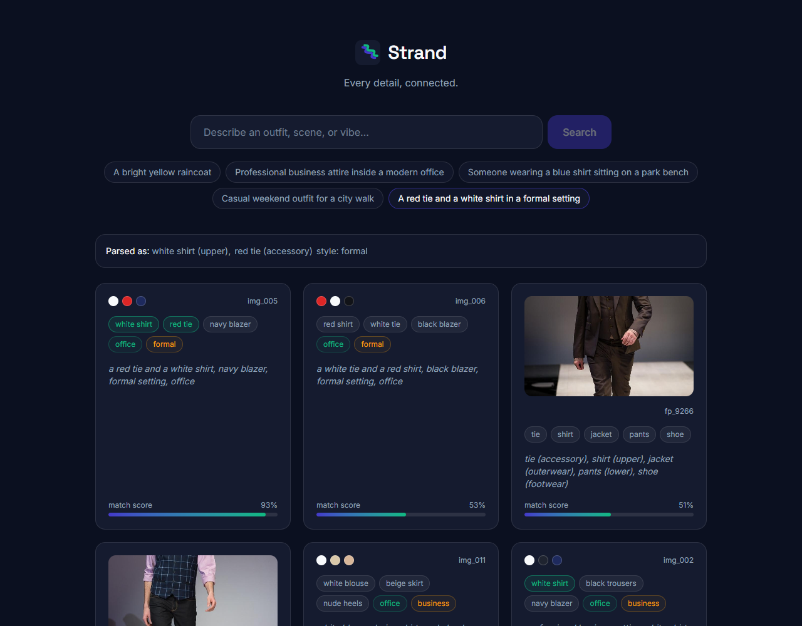
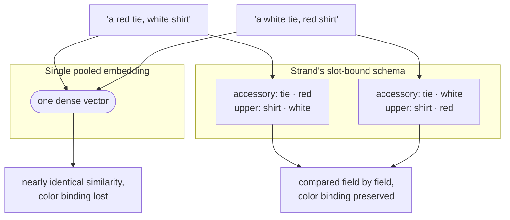
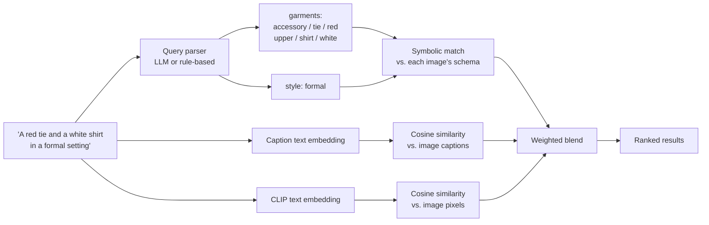
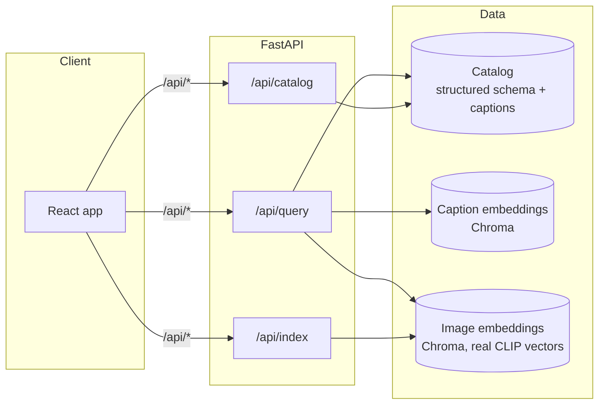

# Strand

[](https://github.com/sh4shv4t/strand/actions/workflows/ci.yml)


**Strand** is a compositional fashion image search engine. It answers natural-language queries like *"a red tie and a white shirt in a formal setting"* by binding garments, colors, scene, and style to separate structured fields instead of pooling an entire description into one embedding, the failure mode that makes vanilla CLIP-style search confuse *"red tie, white shirt"* with *"white tie, red shirt."*



## How it works

A single embedding vector has to represent an entire image at once, so it inevitably blends attributes together: "red tie, white shirt" and "white tie, red shirt" end up almost indistinguishable, because a bag-of-words description doesn't encode *which* color belongs to *which* garment.

Strand avoids this by extracting a structured schema per image, garments bound to slots (upper, lower, outerwear, footwear, accessory) with their own type and color, plus separate scene and style fields, and matching queries against that schema directly:



Retrieval then blends this symbolic signal with dense similarity (both caption-text and real image-pixel embeddings), so phrasing the schema doesn't capture still falls back to something reasonable instead of returning nothing. Here's the same idea traced through an actual query:



Three independent signals feed the final score: exact symbolic matching on the schema, caption-text similarity, and real CLIP image-pixel similarity compared against a persisted embedding per photo. A compositional query like the one above resolves almost entirely through the symbolic path; a stylistic one like *"casual weekend outfit for a city walk"* leans on the dense signals instead. The weighting adapts to how much of the query the parser actually understood, rather than trusting a fixed split for every query.

## Architecture



In production, nginx proxies `/api/*` to the backend server-side, so the browser only ever talks to one origin, no CORS handling needed. The indexing and retrieval sides are cleanly separated at the module level (`services/indexer.py` + `services/image_vector_store.py` for feature extraction and storage, `services/retriever.py` + `services/vector_store.py` + `services/image_similarity.py` for search), sharing only the `schema.py` data contract.

## Model backends

Query parsing and image attribute extraction each go through a single, swappable module (`services/gemini_client.py`), so the LLM/VLM provider isn't wired throughout the codebase, only into one adapter.

| Task | Default | Open-source alternatives |
|---|---|---|
| Query parsing (text → structured schema) | Gemini 2.0 Flash | Llama 3.1/3.3, Qwen2.5, Mistral, any instruction-tuned model with structured/JSON output, self-hosted via Ollama or vLLM |
| Image attribute extraction (photo → garments/scene/style) | Gemini 2.0 Flash | Florence-2 (a LoRA-tuned 0.77B Florence-2 has been shown to beat GPT-4o-mini and Gemini Flash on this exact fashion-JSON task), or general vision-language models like Qwen2-VL, LLaVA-NeXT, InternVL2 |
| Image feature extraction | Marqo-FashionCLIP | already open-source and local by default, no API key involved |

Both the image embeddings and the retrieval logic run entirely locally with no API key. An LLM/VLM key only unlocks open-vocabulary query parsing and automated attribute tagging; without one, the system uses a lightweight rule-based parser and the dataset's own ground-truth garment labels, the same retrieval pipeline either way.

## Data sources

- **[Fashionpedia](https://huggingface.co/datasets/detection-datasets/fashionpedia)** (CC-BY-4.0), real street-style, daily-life, and event photography with ground-truth garment category and bounding-box labels. 1,000 images are sampled from its validation split (`scripts/pull_fashionpedia_sample.py`), and garment slot/type detection comes directly from the dataset's own labels, no manual annotation or model-based labeling involved.
- **A small hand-authored set** (12 records) built specifically to isolate the compositional-binding case: a color-swapped decoy pair ("a red tie and a white shirt" vs. "a white tie and a red shirt") that natural photography can't reliably provide, since it needs two images differing by exactly one color-attribute swap and nothing else.
- Scene and style labels beyond what a dataset provides natively are filled in through the VLM attribute-extraction pipeline described above, not scraped or guessed.

## Tech stack

- **Backend:** Python, FastAPI, Pydantic, Chroma, `open_clip`
- **Frontend:** React, TypeScript, Vite, Tailwind CSS
- **Data:** 1,000 real Fashionpedia photos plus a small hand-authored set isolating the compositional-binding case

## Project structure

```
strand/
├── Working_notes.md      # design log: architecture options, tradeoffs, measured results
├── .github/workflows/ci.yml   # backend pytest + ruff + frontend build/lint on push/PR
├── docker-compose.yml     # backend + frontend, wired together
├── backend/
│   ├── Dockerfile
│   ├── pyproject.toml     # ruff config
│   ├── .env.example       # env vars, documented; sane defaults without a .env at all
│   ├── scripts/
│   │   ├── search.py                     # CLI: python scripts/search.py "a query"
│   │   ├── pull_fashionpedia_sample.py   # builds the real image catalog
│   │   ├── eval_baselines.py             # dense-only vs. hybrid comparison
│   │   ├── eval_clip_baseline.py         # vanilla-CLIP baseline comparison
│   │   ├── tune_alpha.py                 # empirical alpha sweep
│   │   ├── build_image_vector_index.py   # real CLIP feature extraction + storage
│   │   └── extract_attributes_with_vlm.py   # fills in color/scene/style via a VLM
│   ├── tests/
│   └── app/
│       ├── schema.py          # Pydantic models shared by indexing and retrieval
│       ├── observability.py   # structured logging + OpenTelemetry
│       ├── data/               # catalog JSON + real photos
│       ├── services/
│       │   ├── query_parsing.py       # entry point: LLM parser, falls back to keywords
│       │   ├── query_parser.py        # rule-based fallback parser
│       │   ├── llm_query_parser.py    # LLM-based query parser
│       │   ├── vlm_attribute_extractor.py  # VLM image attribute extractor
│       │   ├── gemini_client.py       # the one LLM/VLM integration point
│       │   ├── catalog.py         # loads/caches the combined catalog
│       │   ├── vector_store.py    # caption dense similarity via Chroma
│       │   ├── image_similarity.py    # real CLIP image-pixel similarity
│       │   ├── garment_vocabulary.py   # garment-type synonym canonicalization
│       │   ├── retriever.py       # weighted-hybrid scoring
│       │   ├── clip_model.py      # shared local CLIP model
│       │   ├── indexer.py         # real CLIP feature extraction
│       │   └── image_vector_store.py  # persistent Chroma collection for image embeddings
│       └── routers/            # /api/query, /api/catalog, /api/index
└── frontend/
    └── src/
        ├── components/          # SearchBar, ExampleChips, ResultCard, Logo
        ├── lib/api.ts           # typed client for the query endpoint
        └── App.tsx
```

## Getting started

### Backend

```bash
cd backend
python -m venv .venv
.venv\Scripts\activate        # Windows
pip install -r requirements.txt
uvicorn app.main:app --reload --port 8000
```

This gets you a fully working system: symbolic and caption-dense scoring both run immediately against the committed catalog. Real photos and real CLIP image embeddings are built separately (they're regenerable rather than committed as binary data):

```bash
pip install -r scripts/requirements-eval.txt   # adds datasets, pillow, open_clip_torch
python scripts/pull_fashionpedia_sample.py     # downloads the 1,000 real photos
python scripts/build_image_vector_index.py     # embeds them with local CLIP
```

Both commands are idempotent, safe to re-run any time.

### Frontend

```bash
cd frontend
npm install
npm run dev
```

The dev server proxies `/api/*` to `http://localhost:8000`. Open the printed local URL (default `http://localhost:5173`).

### Docker

```bash
docker compose up --build
```

Serves the frontend at `http://localhost:5173` (nginx, proxying `/api/*` server-side) and the backend directly at `http://localhost:8000`. A named volume persists the embedding model cache across restarts. Run the two data-setup commands above *before* building the image, since the Dockerfile copies the backend directory in at build time.

## Configuration

Copy `backend/.env.example` to `backend/.env`. Every variable has a sane default without one:

```bash
GEMINI_API_KEY=       # enables LLM-based query parsing and VLM attribute extraction
GEMINI_MODEL=         # defaults to gemini-2.0-flash
STRAND_CORS_ORIGINS=  # defaults to the Vite dev server origin
```

Without a key configured, query parsing uses a rule-based parser and attribute extraction relies on ground-truth labels, the retrieval pipeline is identical either way. See [Model backends](#model-backends) for open-source alternatives.

## Search from the command line

```bash
cd backend
python scripts/search.py "a red tie and a white shirt in a formal setting"
```

A plain CLI wrapping the exact same code path `/api/query` uses, no server required. `--top-k` and `--alpha` are optional.

## Testing

```bash
cd backend
pip install -r requirements-dev.txt
ruff check .
pytest -v
```

The suite runs fast and network-independent by default (a deterministic word-overlap fallback stands in for the embedding model). `tests/test_eval_accuracy.py` runs 5 canonical queries end to end through the API and checks retrieval accuracy, not just unit correctness. CI runs lint, the full backend suite, and a frontend build/lint on every push and PR.

## Evaluation

```bash
cd backend
python scripts/eval_baselines.py                      # dense-only vs. hybrid
pip install -r scripts/requirements-eval.txt
python scripts/eval_clip_baseline.py                   # vanilla-CLIP baseline
```

On the compositional decoy pair, dense-only retrieval produces an *exact* score tie between a true match and its color-swapped counterpart, it genuinely cannot tell "red tie, white shirt" from "white tie, red shirt" apart. On the full 1,000-photo catalog, across 8 single-garment probe queries measured against Fashionpedia's own ground truth:

| Method | Mean precision@5 |
|---|---|
| Vanilla CLIP | 0.725 |
| Dense-only (Strand, no symbolic layer) | 0.850 |
| Strand (full hybrid) | **1.000** |

`Working_notes.md` has the full methodology, per-query breakdown, and additional measurements (scaling estimates, ablations, and a few optimizations that were tried and didn't pan out, kept for the record rather than quietly dropped).

## API

| Method | Path | Description |
|---|---|---|
| `POST` | `/api/query` | Parses a natural-language query and returns ranked, scored matches |
| `GET` | `/api/catalog` | Returns the full indexed catalog |
| `POST` | `/api/index` | Runs real CLIP feature extraction on one image; optionally accepts `garments`/`scene`/`style` to register it into the live catalog immediately |

## Further reading

[`Working_notes.md`](./Working_notes.md) is the full engineering log behind this project: the architecture options considered and why this one was chosen, the dataset plan, every measured result (including the ones that didn't work out), and a scaling estimate to a million-image catalog.
